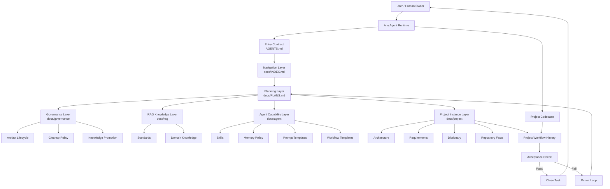
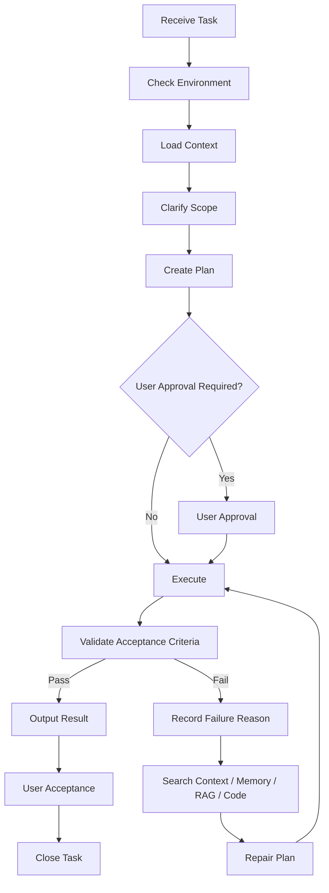
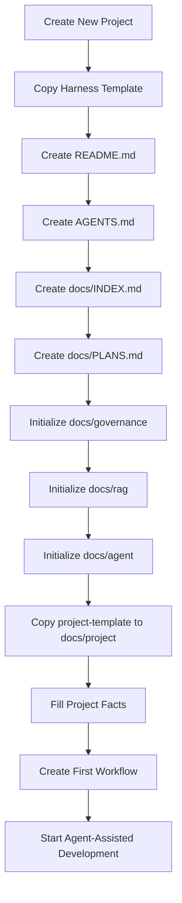

# Harness Engineering 文档架构设计方案

## 1. 背景

随着智能体逐渐参与代码开发、架构分析、测试设计、文档维护、复现排查和长期项目治理，传统项目文档存在几个典型问题：

1. 文档入口不统一，智能体不知道先读什么；
2. 项目事实、任务历史、知识库、记忆、经验总结混在一起；
3. 文档缺少状态、版本、更新时间和过期审查机制；
4. 长期任务中 skill 和 memory 容易被一次性信息污染；
5. 新项目很难快速复制一套可被智能体稳定读取和维护的文档系统；
6. 不同智能体工具的能力不同，但项目不应被某个 runtime 绑定。

因此，需要建立一套通用的 Harness Engineering 文档资产架构，用于约束、组织和治理智能体协作开发过程中的项目上下文。

## 2. Harness Engineering 定义

Harness Engineering 是面向智能体协作开发的项目上下文治理系统。

它不实现 agent runtime，不绑定 Claude Code、Hermes、OpenClaw、Codex 或其他具体智能体工具，而是通过统一入口、索引、计划、项目事实库、RAG 知识库、Skill 库、Memory 治理、Workflow 模板和文档生命周期规则，使任何智能体都可以稳定理解项目、制定计划、执行任务、检查验收标准，并将可复用经验沉淀为长期项目能力。

## 3. 设计目标

Harness Engineering 的目标包括：

1. 建立通用的智能体项目文档入口；
2. 区分通用 Harness 模板和具体项目实例；
3. 明确 RAG、Skill、Memory、Workflow、Project Facts 的边界；
4. 建立任务执行、反馈、验收和修复闭环；
5. 建立文档资产生命周期治理机制；
6. 降低长期项目中 skill、memory、文档索引的污染风险；
7. 支持人类阅读和智能体读取两类使用场景；
8. 支持 Obsidian、NotebookLM 等外部工具作为辅助层，但不把它们作为唯一事实源。

## 4. 设计边界

Harness Engineering 做：

1. 规定智能体进入项目后的阅读顺序；
2. 维护项目文档索引和阶段计划；
3. 组织项目事实、知识库、技能、记忆和工作流；
4. 定义文档资产新增、更新、归档、删除、晋升规则；
5. 定义任务执行生命周期和验收闭环；
6. 为新项目提供可复制的文档模板。

Harness Engineering 不做：

1. 不实现智能体 runtime；
2. 不封装模型调用；
3. 不实现工具调度；
4. 不绑定某个智能体产品或框架；
5. 不把 Obsidian、NotebookLM、Wiki 或外部 RAG 平台作为唯一事实源；
6. 不允许智能体无审查地长期写入 skill、memory 或知识库。

## 5. 通用 Harness Template 与项目实例

Harness 必须区分两层。

### 5.1 通用 Harness Template

通用 Harness Template 是可复制的文档资产模板，用于创建具体项目的 Harness 文档系统。

它包含：

1. 通用入口规则；
2. 文档索引模板；
3. 阶段计划模板；
4. RAG 知识库结构；
5. Skill 模板；
6. Memory 治理规则；
7. Workflow 模板；
8. 文档生命周期治理规则；
9. project-template 项目实例模板。

### 5.2 Project Harness Instance

Project Harness Instance 是某个具体项目复制通用模板后形成的项目文档系统。

它包含：

1. 具体项目需求；
2. 具体项目架构；
3. 具体项目术语；
4. 仓库、分支、构建、测试信息；
5. 真实任务 workflow；
6. 项目级 skill 和 memory；
7. 项目级验收标准；
8. 项目长期演进记录。

通用模板中的 `docs/project-template/` 在具体项目中实例化为 `docs/project/`。

## 6. 推荐目录结构

### 6.1 通用 Harness 仓库结构

```text
.
├── README.md
├── AGENTS.md
│
├── docs/
│   ├── HarnessEngineering.md
│   ├── INDEX.md
│   ├── PLANS.md
│   ├── CHANGELOG.md
│   │
│   ├── governance/
│   │   ├── ArtifactLifecycle.md
│   │   ├── IndexMaintenancePolicy.md
│   │   ├── SkillGovernance.md
│   │   ├── MemoryGovernance.md
│   │   ├── DocumentGovernance.md
│   │   ├── KnowledgePromotionPolicy.md
│   │   └── CleanupPolicy.md
│   │
│   ├── rag/
│   │   ├── RAGIndex.md
│   │   ├── KnowledgeBasePolicy.md
│   │   ├── standard/
│   │   │   ├── docs/
│   │   │   ├── codeconventions/
│   │   │   ├── test/
│   │   │   └── review/
│   │   └── domain/
│   │
│   ├── agent/
│   │   ├── AgentIndex.md
│   │   ├── AgentPolicy.md
│   │   ├── ContextLoadingPolicy.md
│   │   ├── PromptPolicy.md
│   │   ├── MemoryPolicy.md
│   │   ├── SkillPolicy.md
│   │   ├── prompts/
│   │   ├── skills/
│   │   │   ├── SkillIndex.md
│   │   │   ├── _TEMPLATE/
│   │   │   │   └── SKILL.md
│   │   │   └── <category>/
│   │   │       └── <skill-name>/
│   │   │           ├── SKILL.md
│   │   │           ├── references/
│   │   │           ├── templates/
│   │   │           ├── scripts/
│   │   │           └── assets/
│   │   └── workflow-template/
│   │       ├── WorkflowTemplate.md
│   │       ├── TaskLifecycle.md
│   │       └── AcceptanceLoop.md
│   │
│   └── project-template/
│       ├── ProjectIndex.md
│       ├── prd/
│       ├── architecture/
│       ├── dictionary/
│       ├── git/
│       ├── api/
│       ├── data/
│       ├── test/
│       ├── workflow/
│       └── decision/
```

### 6.2 具体项目实例结构

```text
.
├── README.md
├── AGENTS.md
│
├── docs/
│   ├── INDEX.md
│   ├── PLANS.md
│   ├── CHANGELOG.md
│   ├── governance/
│   ├── rag/
│   ├── agent/
│   └── project/
│       ├── ProjectIndex.md
│       ├── prd/
│       ├── architecture/
│       │   └── ARCHITECTURE.md
│       ├── dictionary/
│       │   ├── Glossary.md
│       │   └── SemanticDictionary.md
│       ├── git/
│       │   ├── Repository.md
│       │   └── BranchPolicy.md
│       ├── api/
│       ├── data/
│       ├── test/
│       ├── workflow/
│       └── decision/
│
└── src/
```

## 7. 总体架构图



## 8. AGENTS.md 入口契约

`AGENTS.md` 是所有智能体的通用入口契约。它不适配任何具体工具。

建议规则：

```text
Any agent working in this repository must read:
1. AGENTS.md
2. docs/INDEX.md
3. docs/PLANS.md
4. Task-specific documents listed in docs/INDEX.md
```

`AGENTS.md` 应承载：

1. 文档阅读顺序；
2. 不可违反的硬约束；
3. 项目事实来源规则；
4. RAG 只读规则；
5. Skill 创建和更新规则；
6. Memory 更新规则；
7. Workflow 记录规则；
8. 完成标准和验收规则。

`AGENTS.md` 不应承载：

1. 大量项目知识；
2. 详细架构正文；
3. 完整任务历史；
4. 大段代码或日志；
5. 过期计划；
6. 智能体 runtime 专属配置。

## 9. Context Loading Policy

智能体应按照任务类型加载上下文。

| Task Type | Required Context |
|---|---|
| 架构设计 | `AGENTS.md`, `docs/INDEX.md`, `docs/PLANS.md`, `docs/project/architecture/`, `docs/project/dictionary/` |
| 代码修改 | `AGENTS.md`, `docs/INDEX.md`, `docs/project/git/`, 相关代码文件, 测试规范 |
| 测试设计 | `docs/rag/standard/test/`, `docs/project/test/`, 相关模块架构 |
| Debugging | 最近 workflow、错误日志、相关代码、已知问题 memory、debug skill |
| 文档维护 | 文档规范、目标文档、关联索引、文档治理规则 |
| Skill 沉淀 | workflow 记录、已有 SkillIndex、SkillGovernance、MemoryPolicy |

上下文加载原则：

1. 先读入口，再读索引，再读计划；
2. 不从 memory 单独推断项目事实；
3. 项目事实以 `docs/project/` 为准；
4. RAG 按需检索，不默认全部注入；
5. Skill 先读索引，再按需读取完整 `SKILL.md`；
6. Workflow 只读取与当前任务直接相关的记录。

## 10. RAG / Skill / Memory / Workflow / Project Facts 边界

| 类型 | 本质 | 是否项目绑定 | 是否可频繁更新 | 主要读者 | 推荐格式 |
|---|---|---:|---:|---|---|
| RAG | 稳定知识库 | 不一定 | 否 | 人类 + 智能体检索 | Markdown + YAML frontmatter |
| Skill | 程序性记忆 | 可通用，也可项目绑定 | 谨慎 | 智能体优先 | `SKILL.md` + scripts/templates |
| Memory | 小而稳定的偏好、事实、经验 | 是 | 谨慎 | 智能体优先 | Markdown / YAML |
| Workflow | 某次任务执行历史 | 是 | 是 | 人类 + 智能体 | Markdown |
| Project Facts | 项目权威事实 | 是 | 随项目演进 | 人类 + 智能体 | Markdown |

## 11. Skill 沉淀与治理

Skill 是程序性记忆，用于保存可复用任务执行流程。

### 11.1 Skill 写入条件

只有满足以下条件之一，才建议创建或更新 Skill：

1. 同类任务重复出现 2 次以上；
2. 某次任务产生了明确、可复用的执行流程；
3. 用户纠正了智能体错误做法，且该纠正未来会复用；
4. 某个操作有稳定验收步骤；
5. 某个脚本、模板、checklist 已稳定；
6. 某个调试或分析流程具有跨项目价值。

### 11.2 Skill 禁止写入内容

1. 一次性任务过程；
2. 未验证推测；
3. 大段日志；
4. 大段代码；
5. 临时路径；
6. 与已有 Skill 高度重复的窄流程；
7. 没有触发条件和验收方式的经验总结。

### 11.3 Skill 生命周期

Skill 状态包括：

```text
draft → active → stale → archived
              ↘ deprecated
              ↘ superseded
```

建议使用字段：

```yaml
status: active
owner: human | agent | mixed
createdAt: 2026-05-28
updatedAt: 2026-05-28
reviewAfter: 2026-06-28
usage:
  viewCount: 0
  useCount: 0
  patchCount: 0
  lastViewedAt:
  lastUsedAt:
  lastPatchedAt:
lifecycle:
  pinned: false
  staleAfterDays: 30
  archiveAfterDays: 90
```

## 12. Memory 更新与污染控制

Memory 只保存小而稳定、未来高复用的信息。

### 12.1 允许写入 Memory 的内容

1. 用户明确要求记住的信息；
2. 长期有效的用户偏好；
3. 长期有效的项目约定；
4. 未来任务会反复用到的环境事实；
5. 经过验证的工具缺陷、坑点或 workaround；
6. 能显著减少未来重复对齐成本的事实。

### 12.2 禁止写入 Memory 的内容

1. 大段日志；
2. 大段代码；
3. 临时 TODO；
4. 某天完成了什么；
5. 临时 commit SHA、PR 号、文件路径；
6. 已经写入项目正式文档的事实；
7. 一周内可能过期的信息；
8. 未经验证的推测。

### 12.3 Memory 动作

```text
memory.add       新增记忆
memory.replace   替换已有记忆
memory.remove    删除错误或过期记忆
memory.archive   归档低频但仍有历史价值的记忆
memory.promote   晋升为 Project Facts / Skill / RAG
```

Memory 更新建议默认需要用户确认。若项目后续允许自动写入，必须同时生成变更记录。

## 13. Workflow 模板与真实任务历史

通用 Harness 只保存 workflow 模板。

真实项目任务历史必须保存在：

```text
docs/project/workflow/
```

Workflow 记录应包含：

1. 任务元信息；
2. 最终目标；
3. 本轮任务；
4. 已加载上下文；
5. 执行计划；
6. 用户审批状态；
7. 执行记录；
8. 验收标准；
9. 验收结果；
10. 未解决问题；
11. 是否产生 skill / memory / docs 更新建议。

## 14. 任务生命周期



## 15. 文档资产生命周期

所有重要文档应包含 YAML frontmatter。

推荐基础字段：

```yaml
documentName: docs/path/File.md
version: v1.0.0
updatedAt: 2026-05-28 00:00:00.000 +08:00
status: draft | active | stale | deprecated | archived | superseded
purpose:
scope:
prerequisites:
relatedDocuments:
outputTo:
owner: human | agent | mixed
reviewAfter:
supersededBy:
dependsOn:
```

状态定义：

| Status | 含义 |
|---|---|
| draft | 草稿，尚未稳定 |
| active | 当前有效 |
| stale | 可能过期，需要审查 |
| deprecated | 明确不推荐使用 |
| archived | 已归档，默认不参与上下文加载 |
| superseded | 已被其他文档替代 |

## 16. 索引治理

`docs/INDEX.md` 是文档导航入口，必须保持准确。

索引维护规则：

1. 新增文档后必须更新对应索引；
2. 删除或归档文档后必须更新索引；
3. 一个主题只能有一个主文档；
4. 索引应区分必读、按需读、归档文档；
5. stale、deprecated、archived 文档不得作为默认推荐文档；
6. 索引必须指向事实源，而不是展示型产物。

## 17. 外部工具定位：Obsidian 与 NotebookLM

### 17.1 Obsidian

Obsidian 适合作为 Harness 的人类阅读、编辑和关系导航工具。

建议定位：

```text
Obsidian = Markdown vault editor / human knowledge workspace
GitHub repo = canonical source of truth
Harness docs = agent-readable project context system
```

使用 Obsidian 时，仓库内 Markdown 仍然是事实源，`.obsidian/` 目录只是 vault 配置。`.obsidian/workspace.json` 和 `.obsidian/workspaces.json` 这类工作区布局文件会频繁变化，原则上不应作为项目事实源，也不建议纳入智能体默认上下文加载。

针对当前用户项目中已有 `.obsidian/plugins/dataview`、`.obsidian/plugins/obsidian-git`、`.obsidian/plugins/obsidian-linter` 的情况，建议：

1. Dataview 可用于基于 frontmatter 生成动态索引、状态表、过期审查列表；
2. Obsidian Git 可辅助人类在 vault 中提交和同步文档，但不能替代 GitHub 仓库本身的版本控制规则；
3. Obsidian Linter 可辅助统一 Markdown 和 YAML 风格，但必须避免自动规则破坏 frontmatter 字段；
4. `.obsidian/plugins/` 中的插件代码不应进入智能体上下文；
5. `workspace.json` 可以帮助人类恢复工作区，但不应被视为 Harness 文档资产索引。

### 17.2 NotebookLM

NotebookLM 适合作为外部资料研究和问答辅助工具。

建议定位：

```text
NotebookLM = external research / summarization tool
Harness RAG = reviewed and version-controlled knowledge base
```

NotebookLM 的输出不应直接写入 RAG 或项目事实库，必须经过人工审核。审核后的稳定结论才能进入 `docs/rag/` 或 `docs/project/`。

## 18. 文件形态选择

| 资产类型 | 推荐格式 | 说明 |
|---|---|---|
| 入口约束 | Markdown | `AGENTS.md` |
| 索引 | Markdown + YAML frontmatter | 人类可读、智能体可读 |
| 计划 | Markdown | 阶段目标和当前任务 |
| 架构 | Markdown + Mermaid | 项目事实源 |
| RAG | Markdown + YAML frontmatter | 稳定知识库 |
| Skill | `SKILL.md` + scripts/templates | 程序性记忆 |
| Memory | Markdown / YAML | 小而稳定 |
| Workflow | Markdown | 项目任务历史 |
| 配置 | YAML | 生命周期、索引、策略 |
| 机器产物 | JSON | 索引构建、统计、运行结果 |
| 报告展示 | HTML | 人类验收，不作为事实源 |
| 探索分析 | Notebook | 结论应回写 Markdown |
| Wiki | 可选 | 不作为唯一事实源 |

## 19. 新项目初始化流程



初始化检查清单：

1. 创建 `README.md`；
2. 创建 `AGENTS.md`；
3. 创建 `docs/INDEX.md`；
4. 创建 `docs/PLANS.md`；
5. 初始化 `docs/governance/`；
6. 初始化 `docs/rag/`；
7. 初始化 `docs/agent/`；
8. 将 `docs/project-template/` 复制为 `docs/project/`；
9. 填写项目仓库、分支、构建、测试信息；
10. 填写项目术语字典；
11. 创建第一条 workflow 记录；
12. 检查索引是否完整。

## 20. 首版落地建议

`HarnessEngineering.md v1.0.0` 作为首版架构设计文档可以先提交到 HarnessVault 仓库。

首版提交建议只包含：

1. `README.md`
2. `AGENTS.md`
3. `docs/HarnessEngineering.md`
4. `docs/INDEX.md`
5. `docs/PLANS.md`
6. `docs/governance/README.md`
7. `docs/rag/README.md`
8. `docs/agent/README.md`
9. `docs/project-template/README.md`

不建议首版一次性提交所有子文档正文。原因是当前仍处于架构设计阶段，应先冻结目录、职责、边界和治理规则，再逐步拆分子文档。

## 21. 待后续拆分的子文档

后续可以从本文件拆分出：

1. `docs/governance/ArtifactLifecycle.md`
2. `docs/governance/SkillGovernance.md`
3. `docs/governance/MemoryGovernance.md`
4. `docs/governance/DocumentGovernance.md`
5. `docs/governance/KnowledgePromotionPolicy.md`
6. `docs/governance/CleanupPolicy.md`
7. `docs/agent/ContextLoadingPolicy.md`
8. `docs/agent/SkillPolicy.md`
9. `docs/agent/MemoryPolicy.md`
10. `docs/agent/skills/_TEMPLATE/SKILL.md`
11. `docs/rag/KnowledgeBasePolicy.md`
12. `docs/project-template/ProjectIndex.md`

## 22. 架构决策摘要

1. Harness 不做 agent runtime；
2. Harness 不主动适配具体智能体工具；
3. `AGENTS.md` 是通用智能体入口；
4. `docs/INDEX.md` 和 `docs/PLANS.md` 是固定入口；
5. RAG 是稳定知识库，不保存任务历史；
6. Skill 是程序性记忆，独立治理；
7. Memory 是小而稳定的关键事实和偏好，不保存任务过程；
8. Workflow 是真实任务历史，必须绑定具体项目；
9. `docs/governance/` 是核心治理层；
10. 所有重要文档必须使用 frontmatter；
11. Obsidian 和 NotebookLM 是外部辅助工具，不是唯一事实源；
12. 通用 Harness Template 与 Project Harness Instance 必须严格区分。
