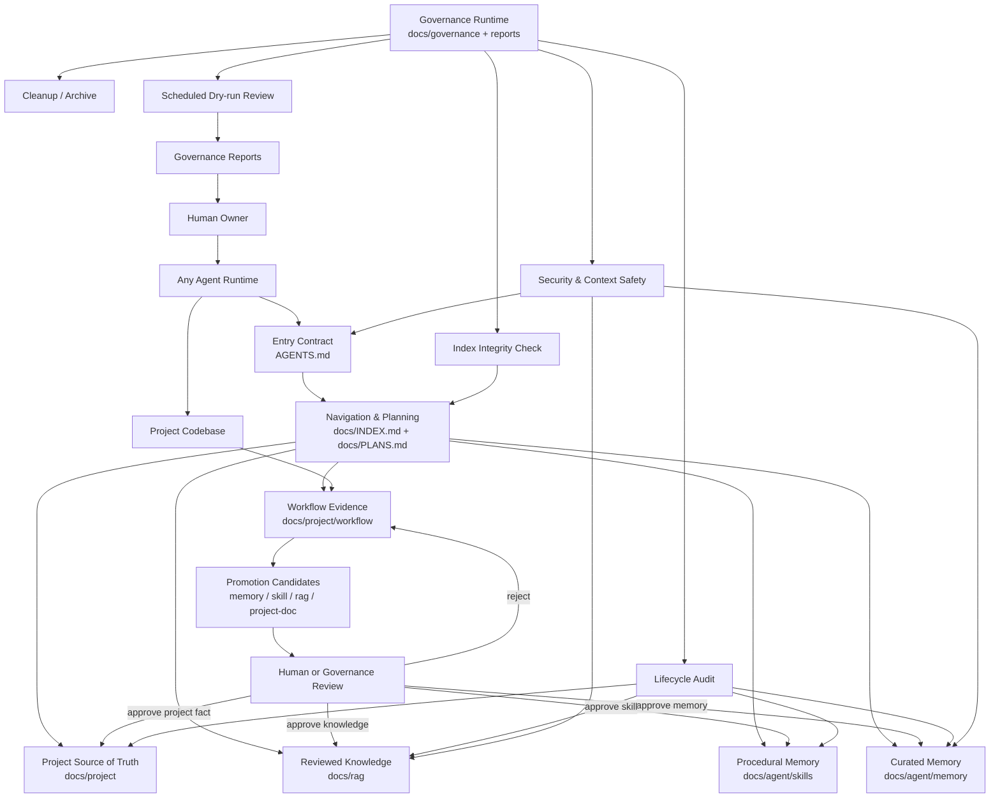
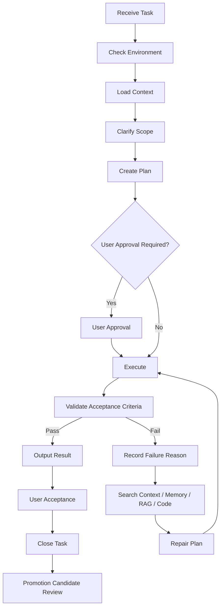
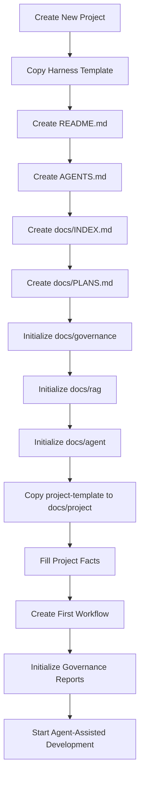

# Harness Engineering 文档架构设计方案

## 1. 背景

随着智能体逐渐参与代码开发、架构分析、测试设计、文档维护、复现排查和长期项目治理，传统项目文档存在几个典型问题：

1. 文档入口不统一，智能体不知道先读什么；
2. 项目事实、任务历史、知识库、记忆、经验总结混在一起；
3. 文档缺少状态、版本、更新时间和过期审查机制；
4. 长期任务中 Skill 和 Memory 容易被一次性信息污染；
5. 新项目很难快速复制一套可被智能体稳定读取和维护的文档系统；
6. 不同智能体工具的能力不同，但项目不应被某个 agent runtime 绑定；
7. 仅有模板仓库不足以支撑长期演进，必须建立记忆、技能、索引、文档资产、定期审查和安全治理机制。

因此，需要建立一套通用的 Harness Engineering 文档资产架构，用于约束、组织和治理智能体协作开发过程中的项目上下文。

v1.0.0 已经建立了入口、索引、计划、RAG、Skill、Memory、Workflow、Project Facts 和治理层的基础边界。v1.1.0 在此基础上进一步强化 Harness 的长期治理能力，重点补充：

1. Harness Governance Runtime Architecture；
2. Scheduled Governance；
3. Memory 分层与污染控制；
4. Skill sidecar telemetry 与 umbrella skill 治理；
5. Workflow Evidence and Promotion Pipeline；
6. Security and Context Safety；
7. Obsidian 文档属性和外部工具边界；
8. 重大架构变更应通过分支和 PR 评审。

## 2. Harness Engineering 定义

Harness Engineering 是面向智能体协作开发的项目上下文治理系统。

它不实现 agent runtime，不封装模型调用，不负责工具调度，也不绑定 Claude Code、Hermes、OpenClaw、Codex 或其他具体智能体工具。它通过统一入口、索引、计划、项目事实库、RAG 知识库、Skill 库、Memory 治理、Workflow 证据记录、文档资产生命周期、定期治理审查和安全边界，使任何智能体都可以稳定理解项目、制定计划、执行任务、检查验收标准，并将可复用经验沉淀为长期项目能力。

更精确地说：

```text
Agent Runtime = 执行任务、调用工具、读写文件、运行命令、管理会话
Harness Engineering = 管理项目上下文、文档资产、知识、记忆、技能、计划、验收和长期治理
```

Harness Engineering 的核心不是“创建很多模板文件”，而是建立一套可长期维护的项目上下文治理架构。

## 3. 设计目标

Harness Engineering 的目标包括：

1. 建立通用的智能体项目文档入口；
2. 区分通用 Harness Template 和 Project Harness Instance；
3. 明确 RAG、Skill、Memory、Workflow、Project Facts 的边界；
4. 建立任务执行、反馈、验收和修复闭环；
5. 建立文档资产生命周期治理机制；
6. 建立 Skill 创建、合并、归档、恢复和使用统计机制；
7. 建立 Memory 写入、替换、删除、归档、晋升和污染控制机制；
8. 建立定期治理审查机制，默认 dry-run，先报告后修改；
9. 降低长期项目中 Skill、Memory、RAG、索引和文档事实源的污染风险；
10. 支持人类阅读和智能体读取两类使用场景；
11. 支持 Obsidian、NotebookLM、Wiki 等外部工具作为辅助层，但不把它们作为唯一事实源；
12. 支持新项目快速实例化一套可被智能体稳定读取、执行和维护的文档系统。

## 4. 设计边界

### 4.1 Harness Engineering 做什么

Harness Engineering 做：

1. 规定智能体进入项目后的阅读顺序；
2. 维护项目文档索引和阶段计划；
3. 组织项目事实、知识库、技能、记忆和工作流；
4. 定义文档资产新增、更新、归档、删除、晋升规则；
5. 定义任务执行生命周期和验收闭环；
6. 定义 Skill 和 Memory 的写入门槛、生命周期和污染控制规则；
7. 定义定期治理审查、审查报告和人工批准机制；
8. 定义索引完整性、frontmatter 完整性、过期审查、安全审查和清理策略；
9. 为新项目提供可复制、可实例化的文档模板。

### 4.2 Harness Engineering 不做什么

Harness Engineering 不做：

1. 不实现智能体 runtime；
2. 不封装模型调用；
3. 不实现工具调度；
4. 不绑定某个智能体产品或框架；
5. 不主动适配 Claude Code、Hermes、OpenClaw、Codex 等工具；
6. 不把 Obsidian、NotebookLM、Wiki 或外部 RAG 平台作为唯一事实源；
7. 不允许智能体无审查地长期写入 Skill、Memory 或 RAG；
8. 不把一次性任务过程直接沉淀为长期记忆或技能；
9. 不把 generated HTML、Notebook、workspace.json、插件代码等展示或工具产物作为项目事实源。

## 5. 通用 Harness Template 与 Project Harness Instance

Harness 必须区分两层：通用 Harness Template 和 Project Harness Instance。

### 5.1 通用 Harness Template

通用 Harness Template 是可复制的文档资产模板，用于创建具体项目的 Harness 文档系统。

它包含：

1. 通用入口规则；
2. 文档索引模板；
3. 阶段计划模板；
4. RAG 知识库结构；
5. Skill 模板；
6. Memory 治理规则；
7. Workflow 模板；
8. 文档生命周期治理规则；
9. Scheduled Governance 规则；
10. Security and Context Safety 规则；
11. Project Template 项目实例模板。

通用 Harness Template 不保存真实项目任务历史。它只保存模板、规范、策略和治理规则。

### 5.2 Project Harness Instance

Project Harness Instance 是某个具体项目复制通用模板后形成的项目文档系统。

它包含：

1. 具体项目需求；
2. 具体项目架构；
3. 具体项目术语；
4. 仓库、分支、构建、测试信息；
5. 真实任务 workflow；
6. 项目级 Skill 和 Memory；
7. 项目级验收标准；
8. 项目长期演进记录；
9. 项目治理报告；
10. 项目知识晋升候选记录。

通用模板中的：

```text
docs/project-template/
```

在具体项目中实例化为：

```text
docs/project/
```

真实项目任务历史必须写入具体项目实例的 `docs/project/workflow/`，不能写入通用 Harness Template 的 workflow 模板目录。

## 6. 推荐目录结构

### 6.1 通用 Harness 仓库结构

```text
.
├── README.md
├── AGENTS.md
│
├── docs/
│   ├── HarnessEngineering.md
│   ├── INDEX.md
│   ├── PLANS.md
│   ├── CHANGELOG.md
│   │
│   ├── governance/
│   │   ├── ArtifactLifecycle.md
│   │   ├── ScheduledGovernance.md
│   │   ├── SecurityGovernance.md
│   │   ├── IndexMaintenancePolicy.md
│   │   ├── SkillGovernance.md
│   │   ├── MemoryGovernance.md
│   │   ├── DocumentGovernance.md
│   │   ├── KnowledgePromotionPolicy.md
│   │   └── CleanupPolicy.md
│   │
│   ├── rag/
│   │   ├── RAGIndex.md
│   │   ├── KnowledgeBasePolicy.md
│   │   ├── standard/
│   │   │   ├── docs/
│   │   │   ├── codeconventions/
│   │   │   ├── test/
│   │   │   └── review/
│   │   └── domain/
│   │
│   ├── agent/
│   │   ├── AgentIndex.md
│   │   ├── AgentPolicy.md
│   │   ├── ContextLoadingPolicy.md
│   │   ├── PromptPolicy.md
│   │   ├── MemoryPolicy.md
│   │   ├── SkillPolicy.md
│   │   ├── prompts/
│   │   ├── memory/
│   │   │   ├── MemoryIndex.md
│   │   │   ├── active/
│   │   │   │   ├── UserMemory.md
│   │   │   │   ├── ProjectMemory.md
│   │   │   │   └── AgentOperationMemory.md
│   │   │   ├── candidates/
│   │   │   └── archive/
│   │   ├── skills/
│   │   │   ├── SkillIndex.md
│   │   │   ├── .skill-usage.json
│   │   │   ├── .archive/
│   │   │   ├── _TEMPLATE/
│   │   │   │   └── SKILL.md
│   │   │   └── <category>/
│   │   │       └── <skill-name>/
│   │   │           ├── SKILL.md
│   │   │           ├── references/
│   │   │           ├── templates/
│   │   │           ├── scripts/
│   │   │           └── assets/
│   │   └── workflow-template/
│   │       ├── WorkflowTemplate.md
│   │       ├── TaskLifecycle.md
│   │       └── AcceptanceLoop.md
│   │
│   ├── reports/
│   │   ├── governance/
│   │   ├── index/
│   │   ├── memory/
│   │   ├── skills/
│   │   ├── rag/
│   │   └── security/
│   │
│   └── project-template/
│       ├── ProjectIndex.md
│       ├── prd/
│       ├── architecture/
│       ├── dictionary/
│       ├── git/
│       ├── api/
│       ├── data/
│       ├── test/
│       ├── workflow/
│       └── decision/
```

### 6.2 具体项目实例结构

```text
.
├── README.md
├── AGENTS.md
│
├── docs/
│   ├── INDEX.md
│   ├── PLANS.md
│   ├── CHANGELOG.md
│   ├── governance/
│   ├── rag/
│   ├── agent/
│   ├── reports/
│   └── project/
│       ├── ProjectIndex.md
│       ├── prd/
│       ├── architecture/
│       │   └── ARCHITECTURE.md
│       ├── dictionary/
│       │   ├── Glossary.md
│       │   └── SemanticDictionary.md
│       ├── git/
│       │   ├── Repository.md
│       │   └── BranchPolicy.md
│       ├── api/
│       ├── data/
│       ├── test/
│       ├── workflow/
│       │   ├── active/
│       │   ├── closed/
│       │   ├── archive/
│       │   └── promotion-candidates/
│       └── decision/
│
└── src/
```

### 6.3 当前仓库迁移说明

如果首版 `HarnessEngineering.md` 已提交在仓库根目录，而文档属性中写的是：

```yaml
documentName: docs/HarnessEngineering.md
```

则 v1.1.0 建议将文件迁移到：

```text
docs/HarnessEngineering.md
```

这样可以保持文件路径、frontmatter、索引和 Harness 文档架构一致。

## 7. 总体架构图



## 8. 分层架构

Harness Engineering 推荐采用九层架构。

| 层级 | 名称 | 主要内容 | 职责 |
|---|---|---|---|
| 1 | Entry Contract Layer | `README.md`, `AGENTS.md` | 为人类和智能体提供入口契约 |
| 2 | Navigation and Planning Layer | `docs/INDEX.md`, `docs/PLANS.md` | 文档导航、阶段计划、任务入口 |
| 3 | Project Source-of-Truth Layer | `docs/project/` | 项目事实源，包含需求、架构、术语、接口、数据、测试 |
| 4 | Knowledge Layer | `docs/rag/` | 稳定、审查后的知识库 |
| 5 | Procedural Memory Layer | `docs/agent/skills/` | 可复用任务执行流程，即 Skill |
| 6 | Memory Layer | `docs/agent/memory/` | 小而稳定的用户偏好、项目约定、工具经验 |
| 7 | Workflow Evidence Layer | `docs/project/workflow/` | 真实任务过程、证据、验收和晋升候选 |
| 8 | Governance Runtime Layer | `docs/governance/`, `docs/reports/` | 生命周期、定期审查、清理、安全、索引治理 |
| 9 | Tooling and Artifact Layer | scripts, JSON, HTML, Notebook, Obsidian, NotebookLM | 工具、脚本、报告和外部辅助层 |

## 9. AGENTS.md 入口契约

`AGENTS.md` 是所有智能体的通用入口契约。它不适配任何具体工具，不写 Claude Code、Hermes、OpenClaw、Codex 等 runtime 专属配置。

建议规则：

```text
Any agent working in this repository must read:
1. AGENTS.md
2. docs/INDEX.md
3. docs/PLANS.md
4. Task-specific documents listed in docs/INDEX.md
```

`AGENTS.md` 应承载：

1. 文档阅读顺序；
2. 不可违反的硬约束；
3. 项目事实来源规则；
4. RAG 只读规则；
5. Skill 创建和更新规则；
6. Memory 更新规则；
7. Workflow 记录规则；
8. 完成标准和验收规则；
9. 安全和上下文污染控制规则；
10. 对智能体输出的格式要求。

`AGENTS.md` 不应承载：

1. 大量项目知识；
2. 详细架构正文；
3. 完整任务历史；
4. 大段代码或日志；
5. 过期计划；
6. 智能体 runtime 专属配置；
7. Obsidian workspace 布局；
8. Notebook、HTML、JSON 运行产物。

## 10. Context Loading Policy

智能体应按照任务类型加载上下文。

| Task Type | Required Context |
|---|---|
| 架构设计 | `AGENTS.md`, `docs/INDEX.md`, `docs/PLANS.md`, `docs/project/architecture/`, `docs/project/dictionary/` |
| 代码修改 | `AGENTS.md`, `docs/INDEX.md`, `docs/project/git/`, 相关代码文件, 测试规范 |
| 测试设计 | `docs/rag/standard/test/`, `docs/project/test/`, 相关模块架构 |
| Debugging | 最近 workflow、错误日志、相关代码、已知问题 memory、debug skill |
| 文档维护 | 文档规范、目标文档、关联索引、文档治理规则 |
| Skill 沉淀 | workflow 记录、已有 SkillIndex、SkillGovernance、MemoryPolicy |
| Memory 更新 | MemoryPolicy、MemoryIndex、候选来源、用户确认记录 |
| RAG 更新 | KnowledgeBasePolicy、KnowledgePromotionPolicy、来源材料、审查记录 |
| 定期治理 | ScheduledGovernance、ArtifactLifecycle、各类 Index、reports |

上下文加载原则：

1. 先读入口，再读索引，再读计划；
2. 不从 Memory 单独推断项目事实；
3. 项目事实以 `docs/project/` 为准；
4. RAG 按需检索，不默认全部注入；
5. Skill 先读 `SkillIndex.md`，再按需读取完整 `SKILL.md`；
6. Workflow 只读取与当前任务直接相关的记录；
7. archived、deprecated、superseded 文档默认不进入上下文；
8. generated report 只能作为证据或审查参考，不作为唯一事实源；
9. `.obsidian/plugins/`、`workspace.json`、HTML、Notebook 输出不应默认进入智能体上下文。

## 11. Harness Governance Runtime Architecture

Harness Governance Runtime 是围绕文档资产、记忆资产、技能资产、任务历史和知识库进行周期性检查、报告、审查、晋升、归档和清理的治理机制。

它不是 agent runtime，不负责模型调用、工具调度和任务执行。它负责保证长期项目上下文不腐化、不污染、不失真。

### 11.1 核心职责

Harness Governance Runtime 负责：

1. 检查文档索引是否准确；
2. 检查 frontmatter 是否完整；
3. 检查文档是否过期；
4. 检查 Skill 是否过窄、重复、长期未使用；
5. 检查 Memory 是否超长、过期、重复、被项目事实替代；
6. 检查 Workflow 是否产生可晋升候选；
7. 检查 RAG 是否存在未经审查的外部资料；
8. 检查 Obsidian / NotebookLM / generated artifacts 是否误入事实源；
9. 生成治理报告；
10. 等待人类审批后执行低风险修复或资产迁移。

### 11.2 治理原则

1. 默认 dry-run；
2. 默认只生成报告，不直接修改；
3. 对 Skill、Memory、RAG、Project Facts 的正式写入必须人工批准；
4. 对索引缺失、路径错误、frontmatter 格式问题这类机械问题，可以允许自动修复，但必须有报告；
5. 所有治理运行必须输出报告；
6. 所有治理修改必须可回滚；
7. 永不自动删除长期资产；
8. 归档必须可恢复；
9. pinned 资产跳过自动 stale / archive 迁移；
10. agent-created 资产和 human-authored 资产必须区分治理。

## 12. Scheduled Governance

Scheduled Governance 是 Harness 的定期治理机制。它不是“定时更新”，而是“定期检查、报告、建议和审批”。

### 12.1 默认策略

```text
Scheduled Governance = dry-run first + report first + human approval + recoverable changes
```

### 12.2 建议治理任务

| 治理任务 | 默认频率 | 是否自动修改 | 输出 |
|---|---:|---:|---|
| Index integrity check | 每次 PR / 每周 | 可自动修复低风险项 | `docs/reports/index/` |
| Frontmatter validation | 每次 PR / 每周 | 可自动修复格式项 | `docs/reports/governance/` |
| Memory audit | 每周 | 不自动修改 | `docs/reports/memory/` |
| Skill audit | 每周 | 不自动修改 | `docs/reports/skills/` |
| Skill usage / stale check | 每月 | 不自动归档，除非配置允许 | `docs/reports/skills/` |
| RAG stale review | 每月 | 不自动修改 | `docs/reports/rag/` |
| Workflow promotion review | 每个阶段结束 | 不自动晋升 | `docs/reports/governance/` |
| Security and context safety check | 每次 PR / 每月 | 阻断高风险项 | `docs/reports/security/` |
| Obsidian artifact check | 每月 | 可建议 `.gitignore` | `docs/reports/governance/` |

### 12.3 Scheduled Governance 状态文件

建议后续引入状态文件：

```text
docs/governance/.governance-state.json
```

用于记录：

```json
{
  "lastRunAt": "2026-05-29T00:00:00+08:00",
  "lastRunSummary": "dry-run only",
  "paused": false,
  "runCount": 1,
  "lastReportPath": "docs/reports/governance/20260529-governance-report.md"
}
```

该文件是机器状态，不是人类主文档。它不应替代治理报告。

## 13. RAG / Skill / Memory / Workflow / Project Facts 边界

| 类型 | 本质 | 是否项目绑定 | 是否可频繁更新 | 主要读者 | 推荐格式 | 是否事实源 |
|---|---|---:|---:|---|---|---:|
| RAG | 稳定知识库 | 不一定 | 否 | 人类 + 智能体检索 | Markdown + YAML frontmatter | 是，限知识 |
| Skill | 程序性记忆 | 可通用，也可项目绑定 | 谨慎 | 智能体优先 | `SKILL.md` + scripts/templates | 是，限流程 |
| Memory | 小而稳定的偏好、事实、经验 | 是 | 谨慎 | 智能体优先 | Markdown / YAML | 半事实源 |
| Workflow | 某次任务执行历史 | 是 | 是 | 人类 + 智能体 | Markdown | 是，限过程证据 |
| Project Facts | 项目权威事实 | 是 | 随项目演进 | 人类 + 智能体 | Markdown | 是，最高优先级 |
| Report | 治理或执行结果 | 是 | 自动生成 | 人类 + 智能体 | Markdown / JSON / HTML | 否，除非被审查吸收 |
| Notebook | 探索性分析 | 是 | 可生成 | 人类为主 | `.ipynb` | 否 |
| Obsidian workspace | 编辑器工作区 | 是 | 高频变化 | 人类 | JSON | 否 |

优先级规则：

```text
Project Facts > RAG / Skill / Memory > Workflow Evidence > Reports > Generated Artifacts
```

如果 Memory 与 Project Facts 冲突，以 Project Facts 为准，并应触发 Memory 审查或删除。

## 14. Memory Architecture

Memory 只保存小而稳定、未来高复用的信息。Memory 不是任务历史，不是日志库，不是项目事实库，也不是 RAG。

### 14.1 Memory 分类

Harness 推荐将 Memory 拆成五类：

| Memory 类型 | 内容 | 写入权限 | 是否进入默认上下文 |
|---|---|---|---:|
| User Memory | 用户长期偏好、沟通方式、强约束 | 用户批准 | 可进入 |
| Project Memory | 项目长期约定、反复踩坑、稳定工作方式 | 用户批准 | 可进入 |
| Agent Operation Memory | 工具缺陷、连接器限制、执行偏好 | 用户批准 | 按需进入 |
| Candidate Memory | 从 Workflow 提取的候选记忆 | 可自动生成候选，不自动生效 | 不进入 |
| Archived Memory | 过期但保留历史价值 | 人工归档 | 不进入 |

### 14.2 推荐目录

```text
docs/agent/memory/
├── MemoryIndex.md
├── active/
│   ├── UserMemory.md
│   ├── ProjectMemory.md
│   └── AgentOperationMemory.md
├── candidates/
│   └── README.md
└── archive/
    └── README.md
```

### 14.3 允许写入 Memory 的内容

1. 用户明确要求记住的信息；
2. 长期有效的用户偏好；
3. 长期有效的项目约定；
4. 未来任务会反复用到的环境事实；
5. 经过验证的工具缺陷、坑点或 workaround；
6. 能显著减少未来重复对齐成本的事实；
7. 已经在多个 workflow 中重复出现的稳定经验。

### 14.4 禁止写入 Memory 的内容

1. 大段日志；
2. 大段代码；
3. 临时 TODO；
4. 某天完成了什么；
5. 临时 commit SHA、PR 号、文件路径；
6. 已经写入项目正式文档的事实；
7. 一周内可能过期的信息；
8. 未经验证的推测；
9. 一次性任务过程；
10. 运行输出、测试完整日志、长 JSON、HTML 报告正文。

### 14.5 Memory 动作

```text
memory.add       新增记忆
memory.replace   替换已有记忆
memory.remove    删除错误或过期记忆
memory.archive   归档低频但仍有历史价值的记忆
memory.promote   晋升为 Project Facts / Skill / RAG
```

### 14.6 Memory 写入规则

Memory 更新默认需要用户确认。若项目后续允许自动写入，必须同时满足：

1. 写入候选先进入 `docs/agent/memory/candidates/`；
2. 自动任务不得直接修改 `active/`；
3. 必须生成变更报告；
4. 必须记录来源 workflow；
5. 必须可回滚；
6. 必须避免重复项；
7. 必须检查是否已经存在于 Project Facts 或 RAG 中。

### 14.7 Memory 快照原则

智能体执行某个任务时，Memory 应被视为任务开始时的上下文快照。

任务中途新增或修改 Memory，不应改变当前任务已经使用的上下文判断。该修改应在后续任务或下一轮上下文加载时生效。

这样可以避免：

1. 中途写入导致上下文漂移；
2. 自动记忆污染当前判断；
3. 多智能体并发修改产生不可解释行为。

## 15. Skill Architecture

Skill 是程序性记忆，用于保存可复用任务执行流程。Skill 既不是 RAG，也不是 Workflow，也不是普通文档。

### 15.1 Skill 的定位

```text
Skill = 可复用任务执行程序 + 触发条件 + 输入要求 + 步骤 + 陷阱 + 验收方式
```

Skill 适合保存：

1. 系统性 debugging 流程；
2. 测试设计流程；
3. 文档审查流程；
4. 架构分析流程；
5. 复现排查流程；
6. 可复用脚本调用方式；
7. 固定验收 checklist。

### 15.2 Skill 写入条件

只有满足以下条件之一，才建议创建或更新 Skill：

1. 同类任务重复出现 2 次以上；
2. 某次任务产生了明确、可复用的执行流程；
3. 用户纠正了智能体错误做法，且该纠正未来会复用；
4. 某个操作有稳定验收步骤；
5. 某个脚本、模板、checklist 已稳定；
6. 某个调试或分析流程具有跨项目价值；
7. 多个 Workflow 证明同一类流程需要标准化。

### 15.3 Skill 禁止写入内容

1. 一次性任务过程；
2. 未验证推测；
3. 大段日志；
4. 大段代码；
5. 临时路径；
6. 与已有 Skill 高度重复的窄流程；
7. 没有触发条件和验收方式的经验总结；
8. 某次会话的完整复盘；
9. 只适用于单个 PR、单个 commit、单个临时错误字符串的内容。

### 15.4 Umbrella Skill 原则

长期项目中禁止形成大量 one-session-one-skill。

Skill 应优先沉淀为 class-level umbrella skill：

```text
一个宽而稳定的 Skill + references/templates/scripts 支撑文件
优于多个窄而重复的 Skill
```

规则：

1. 相似窄 Skill 应合并到一个 umbrella skill；
2. 会话级细节放入 `references/`；
3. 可复制 starter 文件放入 `templates/`；
4. 可重复运行的动作放入 `scripts/`；
5. 被吸收的旧 Skill 进入 `.archive/`；
6. 归档记录必须说明 `absorbedInto`；
7. 归档必须可恢复，不允许直接删除。

### 15.5 Skill 目录结构

```text
docs/agent/skills/
├── SkillIndex.md
├── .skill-usage.json
├── .archive/
├── _TEMPLATE/
│   └── SKILL.md
└── <category>/
    └── <skill-name>/
        ├── SKILL.md
        ├── references/
        ├── templates/
        ├── scripts/
        └── assets/
```

### 15.6 SKILL.md 稳定元数据

`SKILL.md` frontmatter 只保存稳定元数据，不保存运行计数。

```yaml
id: skill.debug.systematic-debugging
name: systematic-debugging
description: Root-cause-first debugging workflow.
version: v1.0.0
status: active
owner: human | agent | mixed
origin: manual | workflow-promotion | memory-promotion | imported
createdAt: 2026-05-29 00:00:00.000 +08:00
updatedAt: 2026-05-29 00:00:00.000 +08:00
reviewAfter: 2026-06-29 00:00:00.000 +08:00
tags:
  - debugging
  - root-cause
  - verification
```

### 15.7 Skill 使用统计 sidecar

Skill 的使用统计、查看统计、patch 统计、pinned 状态和归档状态应放在 sidecar 文件中，而不是写入 `SKILL.md` 正文或 frontmatter。

推荐文件：

```text
docs/agent/skills/.skill-usage.json
```

示例：

```json
{
  "skill.debug.systematic-debugging": {
    "state": "active",
    "pinned": false,
    "origin": "manual",
    "createdBy": "human",
    "viewCount": 12,
    "useCount": 5,
    "patchCount": 1,
    "lastViewedAt": "2026-05-29T00:00:00+08:00",
    "lastUsedAt": "2026-05-29T00:00:00+08:00",
    "lastPatchedAt": null,
    "absorbedInto": null
  }
}
```

这样可以避免机器运行数据污染人类维护的 `SKILL.md`。

### 15.8 Skill 生命周期

Skill 状态包括：

```text
draft → active → stale → archived
              ↘ deprecated
              ↘ superseded
```

状态定义：

| Status | 含义 |
|---|---|
| draft | 草稿，尚未稳定 |
| active | 当前有效，可被索引推荐 |
| stale | 可能过期，需要审查 |
| archived | 已归档，默认不参与上下文加载 |
| deprecated | 明确不推荐使用 |
| superseded | 已被其他 Skill 替代 |

默认建议：

```text
staleAfterDays = 30
archiveAfterDays = 90
```

但 Harness 默认不自动归档。定期治理只生成报告，除非项目显式允许自动归档。

## 16. Workflow Evidence and Promotion Pipeline

Workflow 是某次任务的执行历史和证据记录，不是 Memory、Skill、RAG 或 Project Facts。

### 16.1 Workflow 存放位置

通用 Harness 只保存 workflow 模板。

真实项目任务历史必须保存在：

```text
docs/project/workflow/
```

建议结构：

```text
docs/project/workflow/
├── active/
├── closed/
├── archive/
└── promotion-candidates/
    ├── memory-candidates.md
    ├── skill-candidates.md
    ├── rag-candidates.md
    └── project-doc-candidates.md
```

### 16.2 Workflow 记录内容

Workflow 记录应包含：

1. 任务元信息；
2. 最终目标；
3. 本轮任务；
4. 已加载上下文；
5. 执行计划；
6. 用户审批状态；
7. 执行记录；
8. 验收标准；
9. 验收结果；
10. 未解决问题；
11. 失败原因；
12. 修复循环；
13. 是否产生 Memory / Skill / RAG / Project Docs 更新建议；
14. 输出去向。

### 16.3 晋升路径

```text
Workflow 记录一次任务过程
    ↓ 如果重复出现、稳定、有复用价值
Memory Candidate 保存短小事实或偏好候选
    ↓ 如果变成可执行流程
Skill Candidate 保存程序性步骤候选
    ↓ 如果变成通用领域知识或规范
RAG Candidate 保存稳定知识候选
    ↓ 如果变成项目权威事实
Project Docs 更新项目事实源
```

### 16.4 晋升规则

1. Workflow 可以自动产生候选；
2. 候选不自动生效；
3. Memory / Skill / RAG / Project Facts 的正式写入默认需要人工批准；
4. 晋升必须记录来源 workflow；
5. 晋升必须检查是否与已有文档重复；
6. 晋升后必须更新对应索引；
7. 被替代的旧内容必须标记为 archived / superseded，而不是直接删除。

## 17. RAG 知识库治理

RAG 是稳定知识库，用于保存独立于单次任务的领域知识、工程规范、设计原则、测试规范、文档规范和项目可复用知识。

### 17.1 RAG 应保存

1. 编程规范；
2. 测试规范；
3. 文档规范；
4. 架构原则；
5. 领域知识；
6. 外部资料经人工审核后的稳定结论；
7. 可跨项目复用的方法论。

### 17.2 RAG 不应保存

1. 单次任务历史；
2. 临时日志；
3. 未经审查的 NotebookLM 输出；
4. 未经核验的网页摘要；
5. 项目实时状态；
6. 已经属于 Project Facts 的项目权威事实；
7. 一次性 debugging 过程。

### 17.3 RAG 更新规则

1. RAG 默认只读；
2. 智能体可以提出更新建议；
3. 正式写入需要人工批准；
4. 必须记录来源和审查人；
5. 必须更新 `RAGIndex.md`；
6. 必须设置 `reviewAfter`；
7. 外部资料必须保留来源说明。

## 18. Project Facts 治理

Project Facts 是项目权威事实源，优先级高于 Memory、Skill、Workflow 和 Report。

Project Facts 包括：

1. 需求；
2. 架构；
3. 模块边界；
4. 术语字典；
5. 接口；
6. 数据模型；
7. 仓库、分支、构建和测试方式；
8. 已冻结的架构决策。

规则：

1. 稳定项目事实必须写入 `docs/project/`；
2. 不允许只存在 Memory 中；
3. 不允许只存在 Workflow 中；
4. 不允许只存在聊天记录中；
5. 重大事实变更必须更新索引和相关文档；
6. 若 Memory 与 Project Facts 冲突，应审查并修正 Memory。

## 19. 任务生命周期



任务完成不等于长期资产更新。

任务完成后，如果产生可复用经验，应进入 Promotion Candidate Review，而不是直接写入 Memory、Skill 或 RAG。

## 20. 文档资产生命周期

所有重要文档应包含 YAML frontmatter，以便 Obsidian、人类、智能体和后续治理脚本读取。

### 20.1 推荐基础字段

```yaml
documentName: docs/path/File.md
title: Human Readable Title
aliases:
  - Alias One
tags:
  - harness
version: v1.0.0
createdAt: 2026-05-29 00:00:00.000 +08:00
updatedAt: 2026-05-29 00:00:00.000 +08:00
status: draft | active | stale | deprecated | archived | superseded
type: architecture-design | policy | index | plan | workflow | skill | memory | rag | report
purpose:
scope:
prerequisites:
relatedDocuments:
outputTo:
owner: human | agent | mixed
reviewAfter:
supersededBy:
dependsOn:
```

### 20.2 状态定义

| Status | 含义 |
|---|---|
| draft | 草稿，尚未稳定 |
| active | 当前有效 |
| stale | 可能过期，需要审查 |
| deprecated | 明确不推荐使用 |
| archived | 已归档，默认不参与上下文加载 |
| superseded | 已被其他文档替代 |

### 20.3 删除规则

1. 长期资产默认不直接删除；
2. 先 archived，再由人类决定是否物理删除；
3. 删除前必须确认索引、引用、替代文档；
4. 删除必须有变更记录；
5. 自动治理任务不得物理删除文档。

## 21. 索引治理

`docs/INDEX.md` 是文档导航入口，必须保持准确。

索引维护规则：

1. 新增文档后必须更新对应索引；
2. 删除或归档文档后必须更新索引；
3. 一个主题只能有一个主文档；
4. 索引应区分必读、按需读、归档文档；
5. stale、deprecated、archived 文档不得作为默认推荐文档；
6. 索引必须指向事实源，而不是展示型产物；
7. 索引必须避免指向 Obsidian workspace、插件代码、Notebook 输出和 HTML 报告作为事实源；
8. 自动索引检查可以生成报告，但正式调整建议通过 PR。

## 22. Security and Context Safety

Harness 文档系统会被智能体读取，因此文档资产本身也是安全边界。

### 22.1 主要风险

1. Prompt injection 写入 Memory；
2. Prompt injection 写入 RAG；
3. 外部网页摘要未经审查进入知识库；
4. NotebookLM 输出直接进入 Project Facts；
5. Obsidian 插件代码被误读为项目事实；
6. 大段日志或代码被写入 Memory；
7. generated scripts 未经审查被执行；
8. Secrets 被写入文档；
9. stale 文档误导智能体。

### 22.2 安全规则

1. Memory 和 RAG 写入前必须审查；
2. 外部工具输出不能直接成为事实源；
3. `.obsidian/plugins/` 不进入默认上下文；
4. `workspace.json` 不进入默认上下文；
5. generated HTML 不作为事实源；
6. Notebook 结论必须回写 Markdown 才能成为正式知识；
7. 所有 scripts 进入 Skill 前必须经过人工审查；
8. 文档中不得保存 API key、token、password；
9. 定期治理应检查过期、重复、孤儿、被替代文档。

## 23. 外部工具定位：Obsidian 与 NotebookLM

### 23.1 Obsidian

Obsidian 适合作为 Harness 的人类阅读、编辑和关系导航工具。

建议定位：

```text
Obsidian = Markdown vault editor / human knowledge workspace
GitHub repo = canonical source of truth
Harness docs = agent-readable project context system
```

使用 Obsidian 时，仓库内 Markdown 仍然是事实源，`.obsidian/` 目录只是 vault 配置。

`.obsidian/workspace.json` 和 `.obsidian/workspaces.json` 这类工作区布局文件会频繁变化，原则上不应作为项目事实源，也不建议纳入智能体默认上下文加载。

针对当前用户项目中已有 `.obsidian/plugins/dataview`、`.obsidian/plugins/obsidian-git`、`.obsidian/plugins/obsidian-linter` 的情况，建议：

1. Dataview 可用于基于 frontmatter 生成动态索引、状态表、过期审查列表；
2. Obsidian Git 可辅助人类在 vault 中提交和同步文档，但不能替代 GitHub 仓库本身的版本控制规则；
3. Obsidian Linter 可辅助统一 Markdown 和 YAML 风格，但必须避免自动规则破坏 frontmatter 字段、Mermaid 代码块和 Markdown 表格；
4. `.obsidian/plugins/` 中的插件代码不应进入智能体上下文；
5. `workspace.json` 可以帮助人类恢复工作区，但不应被视为 Harness 文档资产索引；
6. Obsidian properties 应通过 YAML frontmatter 保留，便于 Dataview、智能体和治理脚本读取。

### 23.2 NotebookLM

NotebookLM 适合作为外部资料研究和问答辅助工具。

建议定位：

```text
NotebookLM = external research / summarization tool
Harness RAG = reviewed and version-controlled knowledge base
```

NotebookLM 的输出不应直接写入 RAG 或项目事实库，必须经过人工审核。审核后的稳定结论才能进入 `docs/rag/` 或 `docs/project/`。

### 23.3 Wiki

Wiki 可作为团队阅读和协作入口，但不应成为 Harness 的唯一事实源。

建议：

1. 仓库内 Markdown 是版本源；
2. Wiki 是展示层或协作层；
3. Wiki 中的重要结论应同步回 Markdown；
4. 智能体默认读取仓库内 Harness 文档，而不是外部 Wiki。

## 24. 文件形态选择

| 资产类型 | 推荐格式 | 说明 |
|---|---|---|
| 入口约束 | Markdown | `AGENTS.md` |
| 索引 | Markdown + YAML frontmatter | 人类可读、智能体可读 |
| 计划 | Markdown | 阶段目标和当前任务 |
| 架构 | Markdown + Mermaid | 项目事实源 |
| RAG | Markdown + YAML frontmatter | 稳定知识库 |
| Skill | `SKILL.md` + scripts/templates | 程序性记忆 |
| Skill telemetry | JSON sidecar | `.skill-usage.json` |
| Memory | Markdown / YAML | 小而稳定 |
| Workflow | Markdown | 项目任务历史 |
| 配置 | YAML / JSON | 生命周期、索引、策略 |
| 治理报告 | Markdown + JSON | 人类审查 + 机器读取 |
| 机器产物 | JSON | 索引构建、统计、运行结果 |
| 报告展示 | HTML | 人类验收，不作为事实源 |
| 探索分析 | Notebook | 结论应回写 Markdown |
| Obsidian | Markdown vault | 编辑层，不是唯一事实源 |
| Wiki | 可选 | 不作为唯一事实源 |

## 25. 新项目初始化流程



初始化检查清单：

1. 创建 `README.md`；
2. 创建 `AGENTS.md`；
3. 创建 `docs/INDEX.md`；
4. 创建 `docs/PLANS.md`；
5. 初始化 `docs/governance/`；
6. 初始化 `docs/rag/`；
7. 初始化 `docs/agent/`；
8. 将 `docs/project-template/` 复制为 `docs/project/`；
9. 填写项目仓库、分支、构建、测试信息；
10. 填写项目术语字典；
11. 创建第一条 workflow 记录；
12. 初始化 `docs/reports/`；
13. 检查索引是否完整；
14. 检查所有重要文档 frontmatter 是否完整。

## 26. GitHub 维护策略

HarnessVault 是通用 Harness 文档系统的远程维护仓库。

建议维护规则：

1. `main` 分支保存稳定版本；
2. 架构级变更使用分支和 PR；
3. 普通错别字、路径修复可直接提交，但仍建议保留清晰 commit message；
4. 重大目录结构、生命周期规则、Memory/Skill/RAG 边界变更必须进入 PR；
5. PR 描述必须包含变更原因、影响范围、是否需要迁移已有文档；
6. 合并前至少检查 `AGENTS.md`、`docs/INDEX.md`、`docs/PLANS.md` 是否受影响；
7. 移动文档路径时必须同步 frontmatter 的 `documentName`。

建议分支命名：

```text
design/harness-architecture-v1.1
feature/<feature-name>
docs/<doc-name>
governance/<policy-name>
```

## 27. 后续拆分的子文档

后续可以从本文件拆分出：

1. `docs/governance/ArtifactLifecycle.md`
2. `docs/governance/ScheduledGovernance.md`
3. `docs/governance/SecurityGovernance.md`
4. `docs/governance/SkillGovernance.md`
5. `docs/governance/MemoryGovernance.md`
6. `docs/governance/DocumentGovernance.md`
7. `docs/governance/KnowledgePromotionPolicy.md`
8. `docs/governance/CleanupPolicy.md`
9. `docs/governance/IndexMaintenancePolicy.md`
10. `docs/agent/ContextLoadingPolicy.md`
11. `docs/agent/SkillPolicy.md`
12. `docs/agent/MemoryPolicy.md`
13. `docs/agent/skills/_TEMPLATE/SKILL.md`
14. `docs/agent/memory/MemoryIndex.md`
15. `docs/rag/KnowledgeBasePolicy.md`
16. `docs/project-template/ProjectIndex.md`

v1.1.0 阶段不建议一次性把所有子文档写满。应先冻结架构、目录、生命周期、治理边界，再逐步拆分和落地。

## 28. v1.1.0 相对 v1.0.0 的主要变化

1. 新增 Harness Governance Runtime Architecture；
2. 新增 Scheduled Governance，强调 dry-run first；
3. Memory 从单一概念拆为 User / Project / Agent Operation / Candidate / Archive；
4. Skill 增加 sidecar telemetry，不再建议把 usage 计数写入 `SKILL.md` frontmatter；
5. Skill 增加 umbrella skill 原则，避免 one-session-one-skill 污染；
6. Workflow 增加 Promotion Candidate Pipeline；
7. 增加 Security and Context Safety；
8. 增加 `docs/reports/` 作为治理报告目录；
9. 明确 Obsidian properties 通过 YAML frontmatter 保留；
10. 明确 `.obsidian/plugins/` 和 `workspace.json` 不作为 Harness 事实源；
11. 明确重大架构变更建议通过 GitHub 分支和 PR；
12. 明确当前文件应迁移到 `docs/HarnessEngineering.md`，保持路径和 frontmatter 一致。

## 29. 架构决策摘要

1. Harness 不做 agent runtime；
2. Harness 不主动适配具体智能体工具；
3. `AGENTS.md` 是通用智能体入口；
4. `docs/INDEX.md` 和 `docs/PLANS.md` 是固定入口；
5. RAG 是稳定知识库，不保存任务历史；
6. Skill 是程序性记忆，独立治理；
7. Skill usage telemetry 应放在 sidecar JSON，不污染 `SKILL.md`；
8. Memory 是小而稳定的关键事实和偏好，不保存任务过程；
9. Memory 默认需要人工批准后进入 active；
10. Workflow 是真实任务历史，必须绑定具体项目；
11. Workflow 可以产生晋升候选，但不能直接等同于长期资产；
12. `docs/governance/` 是核心治理层；
13. Scheduled Governance 默认 dry-run；
14. 长期资产默认不直接删除，只归档且可恢复；
15. 所有重要文档必须使用 frontmatter；
16. Obsidian 和 NotebookLM 是外部辅助工具，不是唯一事实源；
17. Obsidian properties 应保留，但 `.obsidian/` 配置不是项目事实源；
18. 通用 Harness Template 与 Project Harness Instance 必须严格区分；
19. Project Facts 优先级高于 Memory、Workflow 和 Report；
20. 重大架构变更应通过分支和 PR 评审。
