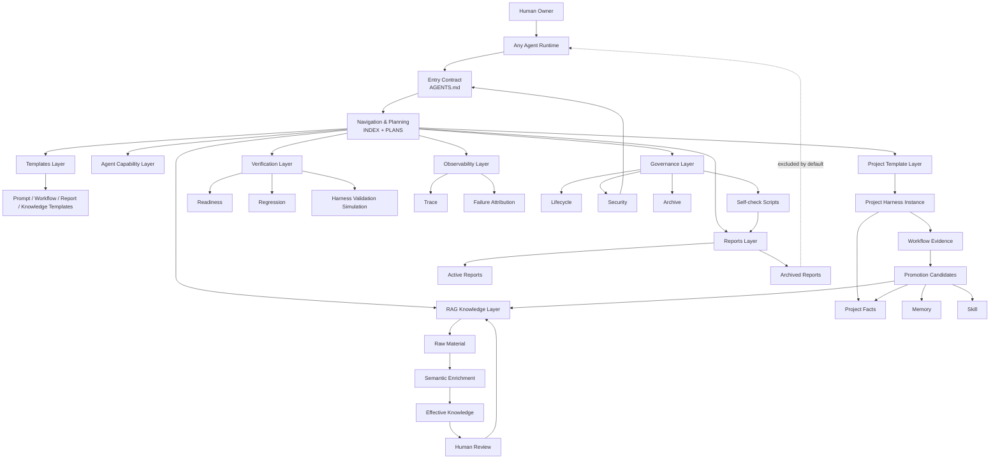

# Harness Engineering 文档架构设计方案

## 1. 背景

智能体逐渐参与代码开发、架构分析、测试设计、文档维护、复现排查和长期项目治理。传统项目文档在智能体协作场景下存在典型问题：入口不统一、项目事实和任务历史混杂、知识库与记忆边界不清、文档缺少生命周期治理、一次性任务经验污染 Skill / Memory / RAG、新项目难以快速复制稳定上下文体系。

Harness Engineering 用于解决这些问题。它不是模板文件集合，而是一套面向智能体的项目上下文治理系统。

v1.2.0 吸收 P0-P15-pre 的落地结果，重点同步当前真实架构：

1. `templates/**` 作为唯一模板源；
2. raw material → semantic enrichment → effective knowledge → review / promotion 的知识库构建路径；
3. agent-readable、human-readable、hybrid、machine-checkable、prompt-structured 文档受众分类；
4. Reports Archive 和 archived report 默认排除规则；
5. Obsidian/Git Boundary；
6. Verification / Simulation 完成态验证；
7. `scripts/**` dry-run self-check 工具层；
8. Complex Task Prompt Template。

v1.2.1 补充 P15b 的 machine-readable Agent Context Manifest：它只保存稳定导航、默认上下文边界和层级 index 映射，不替代 Markdown 事实源。

v1.2.2 落地 P15c 的 RAG intake raw / enriched 空分区：`docs/rag/intake/raw/README.md` 与 `docs/rag/intake/enriched/README.md` 只保存候选分区规则，不保存真实知识正文。

v1.2.3 落地 P15d 的复杂任务 Prompt 入口规则：`AGENTS.md`、[[PromptPolicy]] 与 [[TemplatesIndex]] 均指向 `templates/ComplexTaskPromptTemplate.md`，并明确 XML-like block 是 prompt 结构约定，不是强制 schema。

## 2. Harness Engineering 定义

Harness Engineering 是面向智能体协作开发的项目上下文治理系统。

它不实现 agent runtime，不封装模型调用，不负责工具调度，也不绑定 Claude Code、Hermes、OpenClaw、Codex 或其他具体智能体工具。它通过统一入口、索引、计划、项目事实、RAG 知识库、Skill、Memory、Workflow 证据、文档资产生命周期、治理报告、安全边界和完成态验证，使任意智能体可以稳定理解项目、制定计划、执行任务、检查验收标准，并把可复用经验沉淀为长期项目能力。

```text
Agent Runtime = 执行任务、调用工具、读写文件、运行命令、管理会话
Harness Engineering = 管理项目上下文、文档资产、知识、记忆、技能、计划、验收和长期治理
```

## 3. 设计目标

Harness Engineering 的目标包括：

1. 建立通用的智能体项目文档入口；
2. 区分通用 Harness Template 和 Project Harness Instance；
3. 明确 Project Facts、RAG、Skill、Memory、Workflow、Reports 的边界；
4. 建立任务执行、反馈、验收、修复和回归闭环；
5. 建立文档资产生命周期治理机制；
6. 建立 Knowledge Intake、Knowledge Construction 和 Knowledge Promotion 机制；
7. 建立 Skill 创建、合并、归档、恢复和使用统计机制；
8. 建立 Memory 写入、候选、替换、归档、晋升和污染控制机制；
9. 建立 dry-run、report-first、human approval 的治理机制；
10. 支持人类阅读和智能体读取两类使用场景；
11. 支持 Obsidian、NotebookLM、Wiki 等外部工具作为辅助层，但不把它们作为唯一事实源；
12. 支持新项目快速实例化一套可被智能体稳定读取、执行和维护的文档系统。

## 4. 设计边界

### 4.1 Harness Engineering 做什么

Harness Engineering 做：

1. 规定智能体进入项目后的阅读顺序；
2. 维护项目文档索引和阶段计划；
3. 组织项目事实、知识库、技能、记忆和工作流证据；
4. 定义文档资产新增、更新、归档、删除、晋升规则；
5. 定义任务执行生命周期和验收闭环；
6. 定义 Skill、Memory、RAG、Project Facts 的写入门槛和污染控制规则；
7. 定义定期治理审查、报告和人工批准机制；
8. 定义索引完整性、frontmatter 完整性、过期审查、安全审查和清理策略；
9. 提供新项目可复制、可实例化的文档模板和提示词模板。

### 4.2 Harness Engineering 不做什么

Harness Engineering 不做：

1. 不实现智能体 runtime；
2. 不封装模型调用；
3. 不实现工具调度；
4. 不绑定某个智能体产品或框架；
5. 不主动适配 Claude Code、Hermes、OpenClaw、Codex 等工具；
6. 不把 Obsidian、NotebookLM、Wiki 或外部 RAG 平台作为唯一事实源；
7. 不允许智能体无审查地长期写入 Skill、Memory 或 RAG；
8. 不把一次性任务过程直接沉淀为长期记忆或技能；
9. 不把 generated HTML、Notebook、workspace、graph、插件运行代码等展示或工具产物作为项目事实源；
10. 不在通用 HarnessVault 中保存真实用户知识和具体项目事实。

## 5. 通用 Harness Template 与 Project Harness Instance

Harness 必须区分两层：通用 Harness Template 和 Project Harness Instance。

### 5.1 通用 Harness Template

通用 Harness Template 是可复制的文档资产模板，用于创建具体项目的 Harness 文档系统。

它保存：

1. 通用入口规则；
2. 文档索引和阶段计划；
3. 治理策略；
4. RAG 知识库结构和 intake 规则；
5. Skill / Memory 规则和空结构；
6. Project Template；
7. Report 模板和归档规则；
8. Verification / Observability 规则；
9. Prompt / Workflow / Knowledge 模板；
10. dry-run self-check 脚本。

通用 Harness Template 不保存真实项目任务历史、真实项目事实、真实用户知识和真实 active memory。

### 5.2 Project Harness Instance

Project Harness Instance 是某个具体项目复制通用模板后形成的项目文档系统。

它保存：

1. 具体项目需求；
2. 具体项目架构；
3. 具体项目术语；
4. 仓库、分支、构建、测试信息；
5. 真实任务 workflow；
6. 项目级 Skill 和 Memory；
7. 项目级验收标准；
8. 项目长期演进记录；
9. 项目治理报告；
10. 项目知识晋升候选记录。

通用模板中的：

```text
docs/project-template/
```

在具体项目中实例化为：

```text
docs/project/
```

真实项目任务历史必须写入具体项目实例的 `docs/project/workflow/`，不能写入通用 Harness Template。

## 6. 当前推荐目录结构

### 6.1 通用 HarnessVault 结构

```text
harness/
├── AGENTS.md                         # 智能体入口契约
├── README.md                         # vault 说明
├── docs/
│   ├── INDEX.md                      # 顶层索引
│   ├── PLANS.md                      # 阶段计划
│   ├── HarnessEngineering.md         # 总体架构设计
│   ├── ObsidianSetup.md              # Obsidian 使用说明
│   ├── governance/                   # 治理策略
│   ├── agent/                        # agent context / prompt / skill / memory 规则，含 AgentContextManifest.yaml 辅助入口
│   ├── rag/                          # RAG 知识库结构、intake、standard、domain
│   ├── project-template/             # 项目实例化结构说明，不保存真实项目事实
│   ├── reports/                      # 治理报告、索引报告、安全报告、归档报告
│   ├── observability/                # trace、failure attribution、operation event
│   └── verification/                 # readiness、regression、harness validation
├── templates/                        # 唯一模板源
├── scripts/                          # dry-run self-check scripts
└── .obsidian/                        # Obsidian 编辑配置，不是事实源
```

### 6.2 Project Harness Instance 结构

```text
docs/project/
├── ProjectIndex.md
├── prd/
├── architecture/
├── dictionary/
├── git/
├── api/
├── data/
├── test/
├── workflow/
└── decision/
```

具体项目可以根据需要裁剪目录，但必须保持入口、索引、项目事实、workflow、验收和报告链路可追溯。

## 7. 总体架构图



## 8. 分层架构

Harness Engineering v1.2.x 推荐采用以下架构层。

| 层级 | 名称 | 入口 | 职责 |
|---|---|---|---|
| 1 | Entry Contract Layer | `AGENTS.md`, `README.md` | 规定智能体和人类进入顺序 |
| 2 | Navigation and Planning Layer | `docs/INDEX.md`, `docs/PLANS.md` | 导航、计划、阶段验收 |
| 3 | Governance Layer | `docs/governance/` | 生命周期、边界、安全、归档、受众、晋升 |
| 4 | Agent Capability Layer | `docs/agent/` | 上下文加载、Prompt、Skill、Memory |
| 5 | Templates Layer | `templates/**` | 唯一可复制模板源 |
| 6 | Knowledge / RAG Layer | `docs/rag/` | raw、intake、enriched、standard、domain、promotion |
| 7 | Project Template Layer | `docs/project-template/` | 项目实例结构说明 |
| 8 | Project Instance Layer | `docs/project/` | 真实项目事实和真实 workflow，存在于具体项目实例 |
| 9 | Observability Layer | `docs/observability/` | trace、operation event、failure attribution |
| 10 | Verification Layer | `docs/verification/` | readiness、acceptance、regression、completion validation |
| 11 | Reports and Archive Layer | `docs/reports/` | 治理报告、索引报告、安全报告、归档报告 |
| 12 | Scripts and Tooling Boundary Layer | `scripts/**`, `.obsidian/` | dry-run 自检、Obsidian/Git 边界、外部工具边界 |

## 9. Entry Contract 与索引规则

智能体处理任务时必须优先读取：

```text
1. AGENTS.md
2. docs/INDEX.md
3. docs/PLANS.md
4. task-specific layer index / policy / template
```

`AGENTS.md` 承载入口契约，不承载大量项目知识、不承载完整架构正文、不承载完整任务历史、不承载 runtime 专属配置。

`docs/agent/AgentContextManifest.yaml` 是 machine-checkable 辅助入口，用于表达稳定入口顺序、default include / default exclude、架构层到 index 文档的映射和 artifact boundary。它不替代 Markdown；智能体不能只读取 manifest 来完成任务，实质性判断仍必须回到 `AGENTS.md`、`docs/INDEX.md`、`docs/PLANS.md`、层级 index 和相关 policy / template。

`INDEX.md` 只链接各架构层 index，不直接列出所有子文档。

子目录 README 应链接到对应层级 index；层级 index 应链接回 `INDEX.md`。

## 10. Templates Layer

`templates/**` 是唯一模板源。所有可复制模板、Obsidian / Templater 模板、文档模板、workflow 模板、policy 模板、report 模板、memory 模板、skill 模板、prompt 模板、knowledge 模板都应放在 `templates/**`。

其他目录可以说明如何使用模板，但不应保留重复模板正文。

当前核心模板包括：

1. `WorkflowTemplate.md`；
2. `ReportTemplate.md`；
3. `SkillTemplate.md`；
4. `MemoryTemplate.md`；
5. `GovernancePolicyTemplate.md`；
6. `ComplexTaskPromptTemplate.md`；
7. `RawKnowledgeMaterialTemplate.md`；
8. `EffectiveKnowledgeTemplate.md`。

复杂任务应优先使用 `ComplexTaskPromptTemplate.md`，用 XML-like block 隔离 entry contract、final goal、previous context、feedback、task、inspection scope、constraints、acceptance criteria、output format 和 governance notes。

## 11. Knowledge Base Construction

知识库建设采用四层模型。

| 层级 | 目录建议 | 内容 | 是否事实源 |
|---|---|---|---|
| Raw Material Layer | `docs/rag/intake/raw/` | 原始资料摘要、链接、PDF/网页/笔记元信息 | 否 |
| Semantic Enrichment Layer | `docs/rag/intake/enriched/` | 术语、关键词、适用范围、可信度判断 | 否 |
| Effective Knowledge Layer | `docs/rag/domain/` 或 `docs/rag/standard/` | 审查后的有效知识文档 | 是 |
| Review / Promotion Layer | `docs/reports/rag/` | 审查、冲突、晋升和归档报告 | 证据，不是事实源 |

流程：

```text
raw material
→ semantic enrichment
→ effective knowledge draft
→ human review
→ promotion to RAG domain / standard
→ index update
→ reviewAfter scheduling
```

人类负责来源可信度、使用场景、术语解释、适用范围、领域判断和是否晋升。

智能体可以辅助整理资料、提取关键词、识别候选知识、生成 effective knowledge draft、检查重复、生成 review report 和索引草案。

智能体不得未经审查直接把 raw material 写入 active RAG，不得把 intake 内容当作事实源。

通用 HarnessVault 已提供 `docs/rag/intake/raw/README.md` 与 `docs/rag/intake/enriched/README.md` 作为空分区入口。两个分区只定义候选资料和语义增强的保存规则，默认不进入上下文，未经审查不得晋升为 active RAG。

## 12. Document Audience and Format Strategy

不应把所有 Markdown 都改成 XML 或 JSON。Markdown 仍是主要维护格式；只有需要严格解析的 prompt、trace、report summary、knowledge card、manifest、sidecar 采用更强结构。`docs/agent/AgentContextManifest.yaml` 是 manifest 类 machine-checkable 辅助入口，只承载导航和上下文加载规则，不保存真实项目事实或用户知识。

| 类型 | 主要读者 | 推荐格式 | 示例 |
|---|---|---|---|
| agent-readable | 智能体 | Markdown + frontmatter + 表格 + 明确列表 | AGENTS、INDEX、policy |
| human-readable | 人类 | Markdown 叙述 | 设计说明、教程、背景 |
| hybrid | 人类 + 智能体 | Markdown + 结构化字段 | PLANS、reports、knowledge cards |
| machine-checkable | 脚本 / 工具 | JSON / JSONL / YAML / sidecar | manifest、telemetry、script output |
| prompt-structured | 智能体 | XML-like block + Markdown | complex task prompt |

智能体默认优先读取 agent-readable 和与任务相关的 hybrid 文档；默认不读取 archived reports、Obsidian workspace / graph、插件运行代码、大量原始资料正文和未审查 intake 内容。

## 13. RAG / Skill / Memory / Workflow / Project Facts 边界

| 类型 | 本质 | 是否项目绑定 | 是否频繁更新 | 默认上下文 | 是否事实源 |
|---|---|---:|---:|---:|---:|
| Project Facts | 项目权威事实 | 是 | 随项目演进 | 按任务 | 是，最高优先级 |
| RAG | 稳定知识库 | 不一定 | 谨慎 | 按需 | 是，限知识 |
| Skill | 程序性记忆 | 可通用，也可项目绑定 | 谨慎 | 按任务 | 是，限流程 |
| Memory | 小而稳定的偏好、约定、经验 | 是 | 谨慎 | 按任务 | 半事实源 |
| Workflow | 某次任务执行历史 | 是 | 是 | 相关时 | 过程证据 |
| Report | 治理或执行结果 | 是 | 可生成 | 不默认 | 否，除非被审查吸收 |
| Raw Material | 原始资料 | 不一定 | 可新增 | 不默认 | 否 |
| Archived Report | 历史报告 | 不一定 | 否 | 不默认 | 否 |

优先级规则：

```text
Project Facts > RAG / Skill / Memory > Workflow Evidence > Active Reports > Archived Reports / Generated Artifacts
```

如果 Memory 与 Project Facts 冲突，以 Project Facts 为准，并触发 Memory 审查。

## 14. Governance Runtime

Governance Runtime 是围绕文档资产、记忆资产、技能资产、任务历史和知识库进行周期性检查、报告、审查、晋升、归档和清理的治理机制。

治理原则：

1. 默认 dry-run；
2. 默认 report-first；
3. Skill、Memory、RAG、Project Facts 的正式写入必须人工批准；
4. 低风险机械修复必须有报告；
5. 所有治理修改必须可回滚；
6. 永不自动删除长期资产；
7. archived reports 不进入默认上下文；
8. agent-created 资产和 human-authored 资产必须区分治理。

## 15. Reports and Archive

Reports 是治理证据，不是长期事实源。报告结论只有被写入正式 policy、index、PLANS 或模板后，才成为 Harness 文档事实。

报告分区：

```text
docs/reports/governance/
docs/reports/index/
docs/reports/memory/
docs/reports/skills/
docs/reports/rag/
docs/reports/security/
docs/reports/archive/
```

`docs/reports/archive/` 保存 closed / archived 历史报告。Archived reports 不进入默认上下文，只用于历史追溯。

## 16. Verification and Observability

Verification Layer 定义 readiness、acceptance、regression、failure repair loop 和 Harness 完成态验证规则。

Observability Layer 定义 trace、operation event、failure attribution 和人工介入记录。

验证闭环：

```text
task grounding
→ readiness check
→ runtime execution
→ trace capture
→ acceptance check
→ failure attribution
→ repair
→ regression check
→ close
```

Harness 完成态验证应通过模拟任务检查：

1. 智能体是否能从 `AGENTS.md` 和 `INDEX.md` 找到正确文档；
2. 是否能区分 RAG、Project Facts、Memory、Skill、Workflow、Report；
3. 是否能执行 readiness、trace、verification、regression、promotion candidate；
4. 是否能避免加载 archived reports、Obsidian workspace、plugin runtime code；
5. 是否能按复杂任务 Prompt 模板完成闭环。

## 17. Scripts and Self-check

`scripts/**` 保存 HarnessVault 的辅助检查脚本。

当前核心脚本：

```text
scripts/check_harness_docs.py
```

脚本默认只允许 dry-run，不自动修改文档，不删除文件，不写入用户知识，不写入具体项目事实。

自检至少覆盖：

1. Markdown frontmatter；
2. `documentName` 路径一致性；
3. wikilink 候选解析；
4. README 裸链接风险；
5. `templates/**` template / index 差异规则。

## 18. Obsidian / Git / 外部工具边界

Obsidian 是编辑和导航工具，不是事实源。

允许人工确认后跟踪的轻量配置：

```text
app.json
appearance.json
community-plugins.json
core-plugins.json
plugins/**/manifest.json
plugins/**/data.json
```

必须忽略且不进入默认上下文：

```text
workspace.json
workspace-mobile.json
workspaces.json
graph.json
plugins/**/main.js
plugins/**/styles.css
plugins/**/obsidian_askpass.sh
```

NotebookLM、Wiki、外部 RAG 平台可以作为辅助输入或外部资料来源，但输出必须经过 Knowledge Intake 和人工审查后才能成为有效知识。

## 19. Memory Architecture

Memory 只保存小而稳定、未来高复用的信息。Memory 不是任务历史，不是日志库，不是项目事实库，也不是 RAG。

Memory 分类：

| Memory 类型 | 内容 | 写入权限 | 默认上下文 |
|---|---|---|---:|
| User Memory | 用户长期偏好、沟通方式、强约束 | 用户批准 | 可进入 |
| Project Memory | 项目长期约定、反复踩坑、稳定工作方式 | 用户批准 | 可进入 |
| Agent Operation Memory | 工具缺陷、连接器限制、执行偏好 | 用户批准 | 按需进入 |
| Candidate Memory | 从 Workflow 提取的候选记忆 | 可自动生成候选，不自动生效 | 不进入 |
| Archived Memory | 过期但保留历史价值 | 人工归档 | 不进入 |

Memory 更新默认需要用户确认。候选先进入 candidates，不直接修改 active。

## 20. Skill Architecture

Skill 是程序性记忆，用于保存可复用任务执行流程。Skill 既不是 RAG，也不是 Workflow，也不是普通文档。

Skill 适合保存：

1. 系统性 debugging 流程；
2. 测试设计流程；
3. 文档审查流程；
4. 架构分析流程；
5. 复现排查流程；
6. 可复用脚本调用方式；
7. 固定验收 checklist。

Skill 应优先沉淀为 class-level umbrella skill，避免 one-session-one-skill 污染。

## 21. Prompt Architecture

复杂任务 Prompt 应使用结构化分区。推荐模板：

```text
templates/ComplexTaskPromptTemplate.md
```

核心字段：

```xml
<final_goal>...</final_goal>
<previous_context>...</previous_context>
<current_feedback>...</current_feedback>
<current_task>...</current_task>
<inspection_scope>...</inspection_scope>
<constraints>...</constraints>
<acceptance_criteria>...</acceptance_criteria>
<output_format>...</output_format>
<governance_notes>...</governance_notes>
```

复杂任务 Prompt 必须要求智能体优先读取 `AGENTS.md`、`docs/INDEX.md`、`docs/PLANS.md` 和任务相关文档。

## 22. 后续落地路线

v1.2.0 之后的后续工作：

1. 准备 P15 完成态验证用例；
2. 使用 `docs/agent/AgentContextManifest.yaml` 维护 machine-readable 辅助入口；
3. 执行 P15 Harness 完成态验证；
4. 进入 P16 通用模板冻结与 v1.0.0 发布候选。

## 23. 完成态判断

通用 Harness 架构可视为基本完成，当满足：

1. 入口完整：`AGENTS.md`、[[INDEX]]、[[PLANS]] 可引导智能体；
2. 模板统一：所有可复制模板集中在 `templates/**`；
3. 分层完整：Governance、Agent、RAG、Project Template、Reports、Observability、Verification、Scripts、Templates 均有入口；
4. 生命周期完整：draft、active、review、stale、deprecated、archived 有规则；
5. 知识引入完整：raw、intake、candidate、review、promotion、target asset 有规则；
6. 验证完整：readiness、trace、failure attribution、regression、acceptance 有规则；
7. 报告完整：治理、索引、Memory、Skill、RAG、安全、归档报告有规则；
8. 自检可运行：至少有 dry-run 脚本和报告模板；
9. 模拟可通过：智能体能按 [[HarnessInteractionSimulation]] 完成任务闭环；
10. 不污染：通用仓库不包含真实用户知识和具体项目事实。
