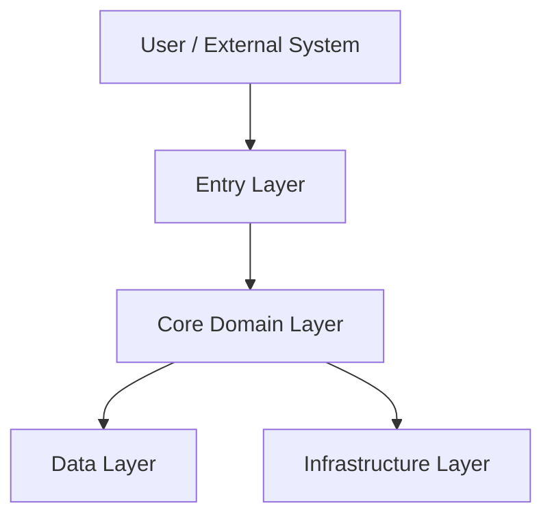

# Project Architecture Template

## 1. 项目信息

| 字段 | 内容 |
|---|---|
| Project Name | `<project-name>` |
| Project Code Name | `<project-code-name>` |
| Architecture Owner | `<owner>` |
| Current Stage | `<stage>` |
| Last Review | `<last-review-date>` |
| Next Review | `<review-after>` |

## 2. 架构定位

用 3 到 5 句话说明项目的架构定位：

```text
<architecture-positioning>
```

## 3. 架构目标

列出项目架构目标：

1. `<architecture-goal-1>`
2. `<architecture-goal-2>`
3. `<architecture-goal-3>`

## 4. 系统边界

### 4.1 In Scope

1. `<in-scope-1>`
2. `<in-scope-2>`
3. `<in-scope-3>`

### 4.2 Out of Scope

1. `<out-of-scope-1>`
2. `<out-of-scope-2>`
3. `<out-of-scope-3>`

## 5. 总体架构图



## 6. 模块分层

| 层级 | 模块 | 职责 | 事实源 |
|---|---|---|---|
| Entry Layer | `<module>` | `<responsibility>` | `<source>` |
| Domain Layer | `<module>` | `<responsibility>` | `<source>` |
| Data Layer | `<module>` | `<responsibility>` | `<source>` |
| Infrastructure Layer | `<module>` | `<responsibility>` | `<source>` |

## 7. 核心数据 / 对象

| 名称 | 类型 | 含义 | 关联文档 |
|---|---|---|---|
| `<object-name>` | `<type>` | `<meaning>` | `<doc-link>` |

## 8. 关键流程

### 8.1 流程一：`<process-name>`

```text
<trigger> -> <step-1> -> <step-2> -> <result>
```

### 8.2 流程二：`<process-name>`

```text
<trigger> -> <step-1> -> <step-2> -> <result>
```

## 9. 架构约束

1. `<constraint-1>`
2. `<constraint-2>`
3. `<constraint-3>`

## 10. 架构决策记录

| ADR | 决策 | 状态 | 日期 |
|---|---|---|---|
| `<ADR-id>` | `<decision>` | `<status>` | `<date>` |

## 11. 待确认问题

1. `<open-question-1>`
2. `<open-question-2>`
3. `<open-question-3>`

## 12. 维护规则

1. 架构事实变化时必须更新本文档。
2. 重大架构决策应同步写入 ADR。
3. 模块命名变化应同步更新 [[SemanticDictionary]]。
4. 仓库、分支、构建命令变化应同步更新 [[Repository]]。
